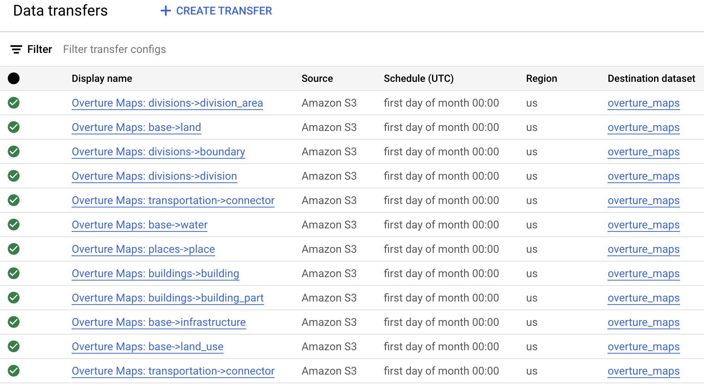

# bigquery-overture

This is a Terraform toolkit that loads [Overture Maps](https://overturemaps.org/) data into BigQuery tables using the [BigQuery Data Transfer Service](https://cloud.google.com/bigquery/docs/dts-introduction).
You can clone this repo and run the terraform immediately; for more information on how it works, read below.

## Terraform instructions

```
export TF_VAR_AWS_ACCESS_KEY_ID=$AWS_ACCESS_KEY_ID
export TF_VAR_AWS_SECRET_ACCESS_KEY=$AWS_SECRET_ACCESS_KEY

tf apply
```




## Manual instructions
#### 1. Setup AWS Access

This process uses [BigQuery Data Transfer Service](https://cloud.google.com/bigquery/docs/dts-introduction), which requires an AWS access key.
Create an AWS user with at least `AmazonS3ReadOnlyAccess` permissions, and then [create an access key](https://docs.aws.amazon.com/IAM/latest/UserGuide/id_credentials_access-keys.html#Using_CreateAccessKey) for that user.
**Save the Access Key ID and Secret Access Key**. You will need them in step 3.

```
export TF_VAR_AWS_ACCESS_KEY_ID=$AWS_ACCESS_KEY_ID
export TF_VAR_AWS_SECRET_ACCESS_KEY=$AWS_SECRET_ACCESS_KEY
```

#### 2. Create the BigQuery tables

Overture contains sets of parquet files categorized by theme and type; each type will be loaded in as a BigQuery table.
- base
    - [`infrastructure`](https://docs.overturemaps.org/schema/reference/base/infrastructure)
    - [`land`](https://docs.overturemaps.org/schema/reference/base/land)
    - [`land_use`](https://docs.overturemaps.org/schema/reference/base/land_use)
    - [`water`](https://docs.overturemaps.org/schema/reference/base/water)
- buildings
    - [`building`](https://docs.overturemaps.org/schema/reference/buildings/building)
    - [`building_part`](https://docs.overturemaps.org/schema/reference/buildings/building_part)
- divisions
    - [`boundary`](https://docs.overturemaps.org/schema/reference/divisions/boundary)
    - [`division`](https://docs.overturemaps.org/schema/reference/divisions/division)
    - [`division_area`](https://docs.overturemaps.org/schema/reference/divisions/division_area)
- places
    - [`place`](https://docs.overturemaps.org/schema/reference/places/place)
- transportation
    - [`connector`](https://docs.overturemaps.org/schema/reference/transportation/connector)
    - [`segment`](https://docs.overturemaps.org/schema/reference/transportation/segment)

Terraform will create the tables for you when you run `tf apply`.

Alternatively, this repo contains the BigQuery schema files for these tables that you can use to create the tables.

```
bq mk --table $PROJECT:$DATASET.infrastructure schemas/infrastructure.json
bq mk --table $PROJECT:$DATASET.land schemas/land.json
bq mk --table $PROJECT:$DATASET.land_use schemas/land_use.json
bq mk --table $PROJECT:$DATASET.water schemas/water.json
bq mk --table $PROJECT:$DATASET.building schemas/building.json
bq mk --table $PROJECT:$DATASET.building_part schemas/building_part.json
bq mk --table $PROJECT:$DATASET.boundary schemas/boundary.json
bq mk --table $PROJECT:$DATASET.division schemas/division.json
bq mk --table $PROJECT:$DATASET.division_area schemas/division_area.json
bq mk --table $PROJECT:$DATASET.place schemas/place.json
bq mk --table $PROJECT:$DATASET.connector schemas/connector.json
bq mk --table $PROJECT:$DATASET.segment schemas/segment.json
```

#### 3. Create and run the data transfer jobs

BigQuery Data Transfer service will automatically download the data from the Overture S3 buckets and save it in BigQuery.
The terraform included in this repo will create one data transfer job per table, and default to update the tables every 30 days.
You can manually create the transfer jobs in the [BigQuery Transfers](https://console.cloud.google.com/bigquery/transfers/) section of the Google Cloud Console, or deploy via Terraform.

```
tf apply
```


Now, **manually run all transfer jobs now** to create tables now without waiting for the monthly schedule. Each job should take about 10 minutes

#### 4. Create materialized views with `GEOGRAPHY` type

To run geospatial queries, the table needs a `GEOGRAPHY` column. Parquet includes the geospatial data in WKB format, which needs to be converted. 
Modify the query in `create_mv.sql` and run it for each table. For example,

```
create materialized view `<PROJECT>.overture_maps.buildings_mv`
    cluster by geometry
    as (
      SELECT
        * except(geometry),
        st_geogfromwkb(geometry) as geometry
      FROM `<PROJECT>.overture_maps.buildings`
    )
```

The materialized views will automatically remain up-to-date with the base tables as they are refreshed once per month.
